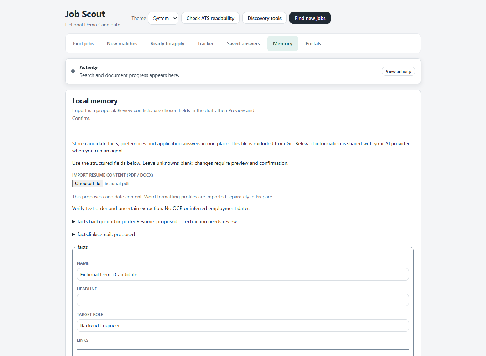
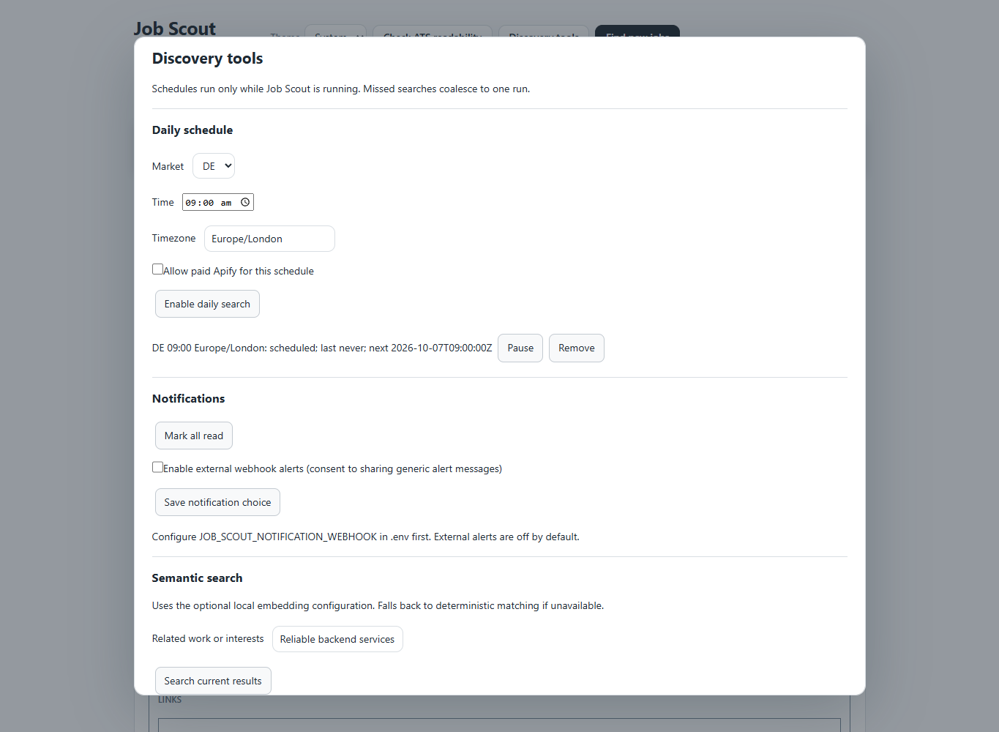
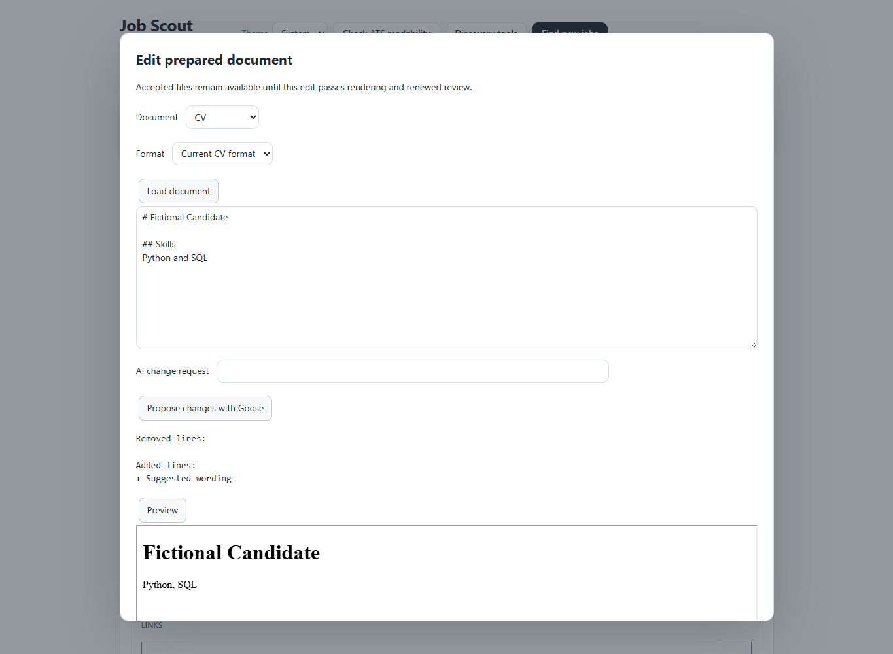
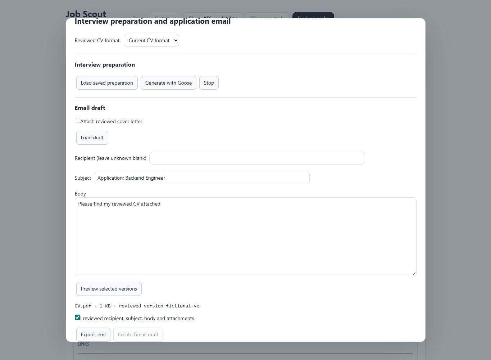

# Reproducible fictional demo

Run `npm ci`, ensure Chrome/Edge is installed, then `npm run demo`.
The browser walkthrough serves the real UI with fictional API fixtures. Every
nonlocal browser request is blocked. It never reads candidate Memory or credentials,
starts a live search, invokes Goose, sends an alert or creates an external draft.

The script checks these steps:

1. Open Memory, edit a structured name field, preview, confirm and check the revision.
2. Import a fictional readable PDF; verify proposals do not silently save.
3. Open Discovery tools, configure a fictional free schedule and inspect deterministic
   fallback when embeddings are unavailable.
4. Load a fictional prepared document, reject an AI proposal and preview the edit.
5. Preview an email, verify export is blocked before review, then export an unsent draft.

Captures are written to ignored `.workspace/demo/`. The screenshots below were
captured from this walkthrough; mocked data/model results are not live validation.

CI runs on Windows and Linux with Node 22 and 24 using locked dependencies. Browser
tests require Chrome (GitHub-hosted runners include it); missing browsers fail CI.
Browser discovery passes the resolved executable path to Playwright. CI explicitly
selects its runner Python executable for DOCX extraction; Windows installer tests
isolate Windows PowerShell module discovery from the parent PowerShell 7 shell.
Windows installer tests deliberately skip on Linux. Live portals, AI providers,
paid scrapers, Overleaf publication, Gmail and webhooks are intentionally excluded.
No workflow uploads private directories or generated reports.

No licence existed at implementation time. MIT is the recommendation for a simple
permissive project licence; Apache-2.0 is another option if explicit patent terms
are desired. Selection remains pending with the owner, so no licence was assigned.
